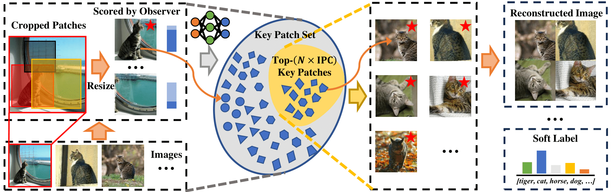

# On the Diversity and Realism of Distilled Dataset: An Efficient Dataset Distillation Paradigm

[Peng Sun](https://sp12138.github.io/), Bei Shi, Daiwei Yu, [Tao Lin](https://tlin-taolin.github.io/)

[`arXiv`](https://arxiv.org/abs/2312.03526) | [`BibTeX`](#bibliography)

This is an official PyTorch implementation of the paper **On the Diversity and Realism of Distilled Dataset: An Efficient Dataset Distillation Paradigm (Preprint 2023)**. In this work, we:

- We delineate three key objectives for effective dataset distillation on large-scale high-resolution datasets: realism, diversity, and efficiency.
- We introduce the compression rate of information and a realism score backed by $\mathcal{V}$-information theory, together with an optimization-free efficient paradigm, to condense diverse and realistic data.
- Extensive experiments substantiate the effectiveness of our method: it can distill the full ImageNet-1K to a small dataset comprising 10 images per class within 7 minutes, achieving a notable 42% top-1 accuracy with ResNet-18 on a single RTX-4090 GPU (while the SOTA only achieves 21% but requires 6 hours).

## Abstract

<p align="center">

</p>

Contemporary machine learning requires training large neural networks on massive datasets and thus faces the challenges of high computational demands. Dataset distillation, as a recent emerging strategy, aims to compress real-world datasets for efficient training. However, this line of research currently struggle with large-scale and high-resolution datasets, hindering its practicality and feasibility. To this end, we re-examine the existing dataset distillation methods and identify three properties required for large-scale real-world applications, namely, realism, diversity, and efficiency. As a remedy, we propose RDED, a novel computationally-efficient yet effective data distillation paradigm, to enable both diversity and realism of the distilled data.

## TODOs

- [ ] Give the format for dataset structuring.
- [ ] Separate the processes of validation and relabeling.

## Usage

### Requirements

```
torchvision==0.16.0
torch==2.1.0
```

### How to Run

The main entry point of a single experiment is [`main.py`](main.py). To facilitate experiments running, we provide [`scripts`](scripts/) for running the bulk experiments in the paper. For example, to run `RDED` for condensing ImageNet-1K into small dataset with $\texttt{IPC} = 10$ using ResNet-18, you can run the following command:

```shell
bash ./scripts/imagenet-1k_10ipc_resnet-18_to_resnet-18_cr5.sh
```

### Pre-trained Models
Following [SRe$^2$L](https://github.com/VILA-Lab/SRe2L), we adapt official [Torchvision code](https://github.com/pytorch/vision/tree/main/references/classification) to train the observer models from scratch.
All our pre-trained observer models listed below are available at [link](https://drive.google.com/drive/folders/1HmrheO6MgX453a5UPJdxPHK4UTv-4aVt?usp=drive_link).

| **Dataset**    | **Backbone**        | **Top1-accuracy** | **Input Size**   |
| -------------- | ------------------- | ----------------- | ---------------- |
| CIFAR10        | ResNet18 (modified) | 93.86             | 32 $\times$ 32   |
| CIFAR10        | Conv3               | 82.24             | 32 $\times$ 32   |
| CIFAR100       | ResNet18 (modified) | 72.27             | 32 $\times$ 32   |
| CIFAR100       | Conv3               | 61.27             | 32 $\times$ 32   |
| Tiny-ImageNet  | ResNet18 (modified) | 61.98             | 64 $\times$ 64   |
| Tiny-ImageNet  | Conv4               | 49.73             | 64 $\times$ 64   |
| ImageNet-Nette | ResNet18            | 90.00             | 224 $\times$ 224 |
| ImageNet-Nette | Conv5               | 89.60             | 128 $\times$ 224 |
| ImageNet-Woof  | ResNet18            | 75.00             | 224 $\times$ 224 |
| ImageNet-Woof  | Conv5               | 67.40             | 128 $\times$ 128 |
| ImageNet-10    | ResNet18            | 87.40             | 224 $\times$ 224 |
| ImageNet-10    | Conv5               | 85.4              | 128 $\times$ 128 |
| ImageNet-100   | ResNet18            | 83.40             | 224 $\times$ 224 |
| ImageNet-100   | Conv6               | 72.82             | 128 $\times$ 128 |
| ImageNet-1k    | Conv4               | 43.6              | 64 $\times$ 64   |

## Bibliography

If you find this repository helpful for your project, please consider citing our work:

```
@InProceedings{sun2024diversity,
  title={On the Diversity and Realism of Distilled Dataset: An Efficient Dataset Distillation Paradigm},
  author={Sun, Peng and Shi, Bei and Yu, Daiwei and Lin, Tao},
  booktitle = {Proceedings of the IEEE/CVF Conference on Computer Vision and Pattern Recognition (CVPR)},
  year={2024}
}
```

## Reference

Our code has referred to previous work:
- [Squeeze, Recover and Relabel: Dataset Condensation at ImageNet Scale From A New Perspective](https://github.com/VILA-Lab/SRe2L)
- [Dataset Condensation via Efficient Synthetic-Data Parameterization](https://github.com/snu-mllab/Efficient-Dataset-Condensation)
